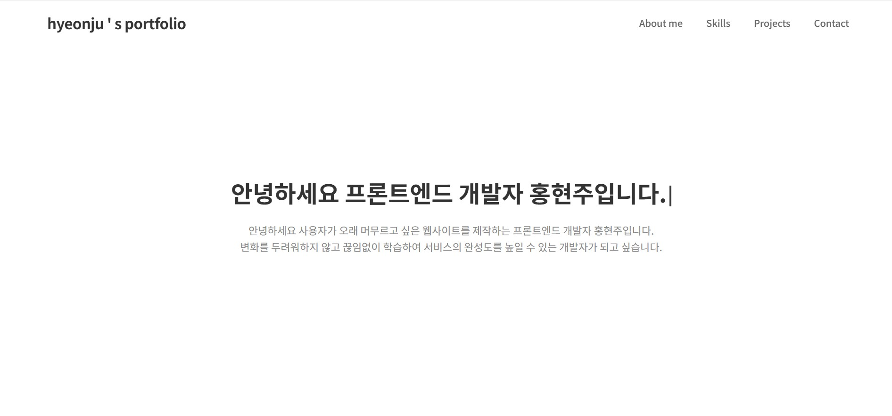
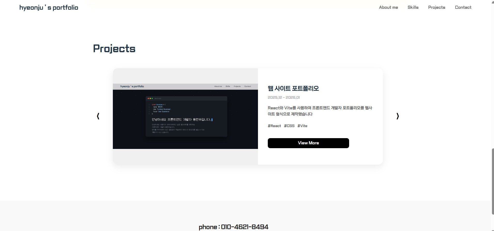
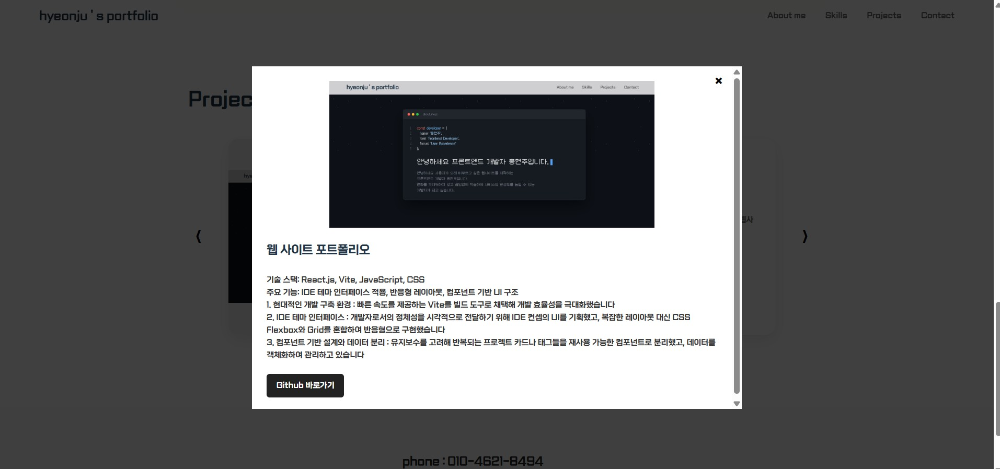

# Hyeonju's Portfolio
## "사용자가 오래 머물고 싶은 웹을 만듭니다."

개발자로서 정체성을 담은 코딩 컨셉의 프론트엔드 포트폴리오 웹사이트입니다.

### [Tech Stack]
React, Vite, JavaScript, CSS, Lucide-React

### [Key Features]
1. Developer Desktop Interface
    사용자가 웹사이트에 접속했을 때 개발자의 편집기를 엿보는 듯한 경험을 제공하기 위해 코딩화면과 같은 인터페이스를 구현했습니다.
2. Personalized Design System
    전체적으로 가독성을 높이고, 컨셉을 극대화시킬 수 있는 폰트를 사용했습니다.
3. 컴포넌트 기반 설계 및 데이터 분리
    유지보수를 고려해 반복되는 프로젝트 카드나 태그들을 재사용 가능한 공통 컴포넌트로 분리했고, 데이터를 객체화하여 관리합니다.
 
### [Project Structure]
```text
my-portfolio/
 ┣ public/
 ┣ src/
 ┃ ┣ assets/          # 이미지 리소스
 ┃ ┣ font/            # 폰트 파일 (이사만루, 둥근모)
 ┃ ┣ components/      # 공통 컴포넌트 관리(모달창)
 ┃ ┣ App.css          # 전체 스타일링
 ┃ ┣ App.jsx          # 메인 로직
 ┃ ┗ main.jsx         # 엔트리 포인트
 ┣ .gitignore
 ┣ index.html
 ┣ package.json
 ┗ README.md
```
### [Preview]





### [Contact]
    Email : hyeonjuhong67@gmail.com
    Phone : 010-4621-8494
