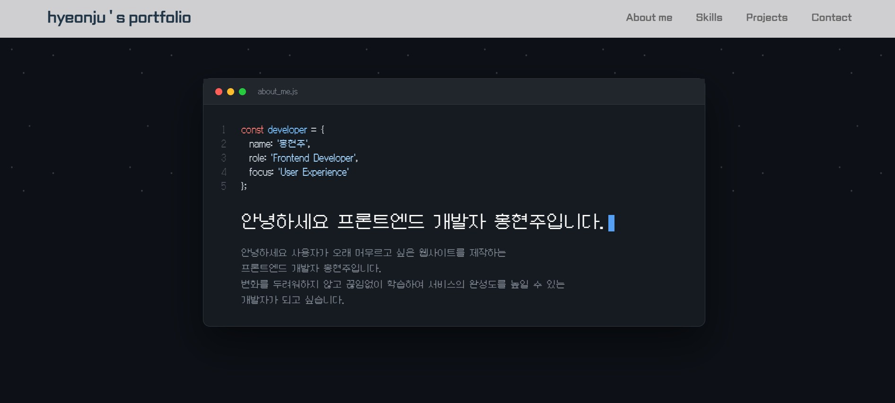
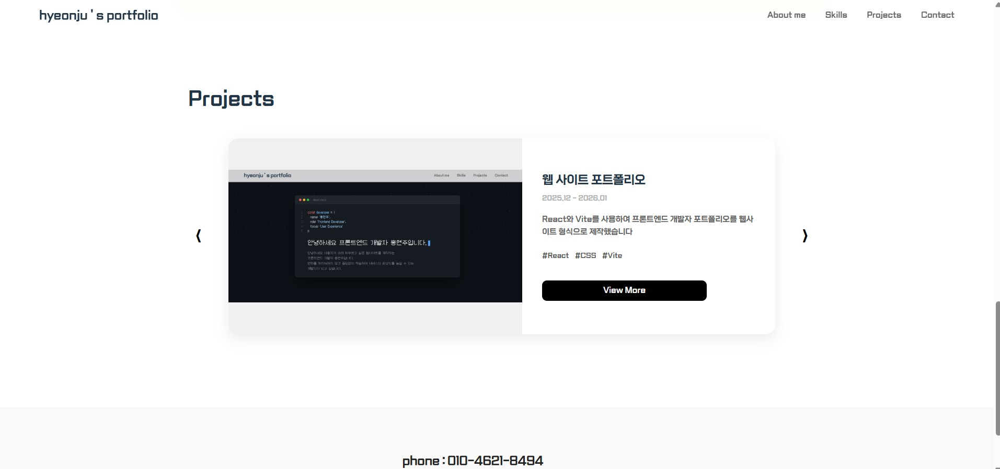

# Hyeonju's Portfolio

## "사용자가 오래 머물고 싶은 웹을 만듭니다."

개발자로서 정체성을 담은 코딩 컨셉의 프론트엔드 포트폴리오 웹사이트입니다.

### [Tech Stack]

Next.js (App Router), React, TypeScript, CSS, Vercel

### [Key Features]

1. Developer Desktop Interface
   사용자가 웹사이트에 접속했을 때 개발자의 편집기를 엿보는 듯한 경험을 제공하기 위해 코딩화면과 같은 인터페이스를 구현했습니다.
2. Personalized Design System
   전체적으로 가독성을 높이고, 컨셉을 극대화시킬 수 있는 폰트를 사용했습니다.
3. 컴포넌트 기반 설계
   유지보수를 고려해 반복되는 프로젝트 카드나 태그들을 재사용 가능한 공통 컴포넌트로 분리했고, 데이터를 객체화하여 관리합니다.
4. App Router `metadata` API 기반 SEO 구축
   Metadata API를 적용하여 포트폴리오 메타 정보 및 소셜 링크 공유 카카오톡/스랙 카드 설정을 완성했습니다.

### [Project Structure]

```text
my-portfolio/
 ┣ app/
 ┃ ┣ layout.tsx       # Root Layout & SEO Metadata
 ┃ ┗ page.tsx         # Entry Page
 ┣ public/
 ┃ ┗ assets/          # 이미지
 ┣ src/
 ┃ ┣ components/      # 클라이언트 컴포넌트 (HeroSection, ProjectSlider,ProjectModal)
 ┃ ┣ font/            # 커스텀 폰트 파일
 ┃ ┣ App.css          # 전체 스타일링
 ┃ ┗ App.tsx          # 메인 서버 컴포넌트 & 데이터
 ┣ .gitignore
 ┣ next.config.ts
 ┣ package.json
 ┗ README.md
```

### [Preview]





### [Contact]

    Email : ghdguswn6@naver.com
    Phone : 010-4621-8494
